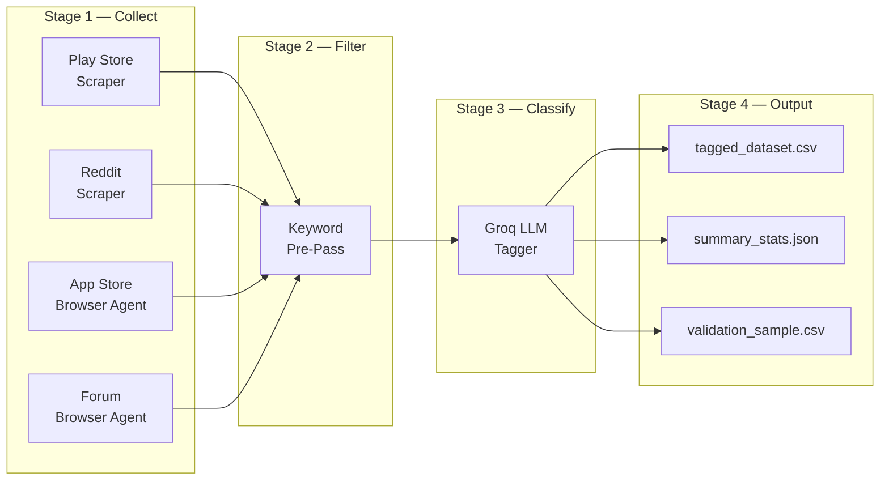
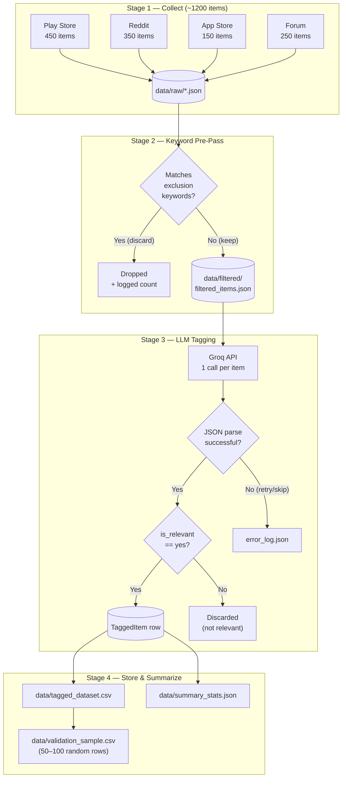
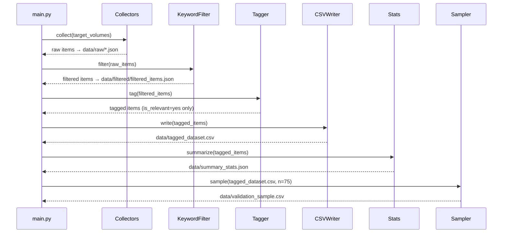
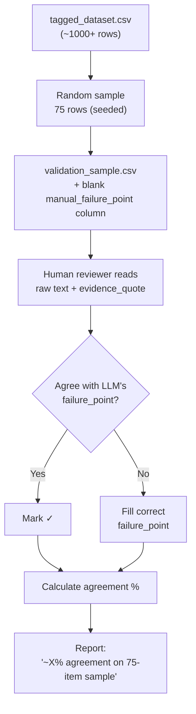

# Architecture — AI-Powered Discovery Engine
## Google Photos Retrieval Research Pipeline

---

## 1. High-Level Architecture

The system is a **linear, batch-processing pipeline** with four discrete stages.
There is no server, no database, and no user-facing UI — it is a CLI-driven
research tool designed to run once (or be re-run) and produce a single CSV artifact.



### Design Principles
| Principle | Rationale |
|-----------|-----------|
| **Strictly linear pipeline** | PRD constraint: "explainable in a single slide" — no DAGs, no parallelism logic needed. |
| **Stage-level checkpointing** | Each stage writes intermediate files to `data/`. If the pipeline crashes at Stage 3, Stages 1–2 don't re-run. |
| **No root-cause assumptions baked in** | Problem Statement explicitly forbids pre-assumed causes; the classification schema stays open-ended. |
| **Traceable evidence** | Every tagged row carries an `evidence_quote` linking back to raw source text. |

---

## 2. Directory Structure

```
GooglePhotos_Discovery_Model/
│
├── ProblemStatement.md              # Why this engine exists
├── PRD.md                           # What to build (requirements)
├── architecture.md                  # This file — how to build it
│
├── config/
│   ├── settings.yaml                # All tunables (volumes, model, thresholds)
│   └── prompts/
│       └── classification.txt       # Exact LLM system prompt (from PRD §4)
│
├── src/
│   ├── __init__.py
│   ├── main.py                      # CLI entry point — orchestrates the pipeline
│   │
│   ├── collectors/                   # Stage 1 — Data Collection
│   │   ├── __init__.py
│   │   ├── base.py                  # Abstract BaseCollector class
│   │   ├── play_store.py            # google-play-scraper wrapper
│   │   ├── reddit.py                # Browser automation agent stub
│   │   ├── app_store.py             # RSS feed fetcher (+ browser fallback)
│   │   └── forum.py                 # Browser automation agent stub
│   │
│   ├── filter/                       # Stage 2 — Relevance Pre-Pass
│   │   ├── __init__.py
│   │   └── keyword_filter.py        # Cheap keyword exclusion filter
│   │
│   ├── classifier/                   # Stage 3 — LLM Classification
│   │   ├── __init__.py
│   │   ├── groq_client.py           # Groq API wrapper (auth, retry, rate-limit)
│   │   ├── tagger.py                # Prompt builder + JSON parser
│   │   └── schema.py                # Pydantic models for input/output validation
│   │
│   ├── output/                       # Stage 4 — Storage & Aggregation
│   │   ├── __init__.py
│   │   ├── csv_writer.py            # Write tagged_dataset.csv
│   │   └── stats.py                 # Aggregate counts → summary_stats.json
│   │
│   ├── validation/                   # Validation Step
│   │   ├── __init__.py
│   │   └── sampler.py               # Random sample extraction for manual review
│   │
│   └── utils/
│       ├── __init__.py
│       ├── logger.py                # Structured logging (stage, source, counts)
│       └── io.py                    # JSON/CSV read-write helpers
│
├── data/                            # All pipeline artifacts (gitignored except samples)
│   ├── raw/                         # Stage 1 output — one JSON file per source
│   │   ├── play_store_raw.json
│   │   ├── reddit_raw.json
│   │   ├── app_store_raw.json
│   │   └── forum_raw.json
│   ├── filtered/                    # Stage 2 output
│   │   └── filtered_items.json
│   ├── tagged_dataset.csv           # Stage 3 final output
│   ├── summary_stats.json           # Stage 4 aggregate counts
│   └── validation_sample.csv        # 50–100 row sample for manual review
│
├── .env.example                     # Template for secrets (Reddit creds, Groq key)
├── requirements.txt                 # Python dependencies
└── README.md                        # Quick-start guide
```

---

## 3. Data Flow & Schemas

### 3.1 Raw Item Schema (Stage 1 → Stage 2)

Every collector must produce items conforming to this exact shape. Stored as
JSON arrays in `data/raw/<source>_raw.json`.

```python
# src/classifier/schema.py — RawItem

class RawItem(BaseModel):
    source: Literal["play_store", "reddit", "app_store", "forum"]
    text: str                          # Review/post body
    date: Optional[str] = None         # "YYYY-MM-DD" or null
    rating: Optional[float] = None     # Numeric or null
    url: Optional[str] = None          # Direct link or null
```

### 3.2 Filtered Item Schema (Stage 2 → Stage 3)

Identical to `RawItem` — filtering only removes rows, it does not add/change
fields. A `filter_stats` sidecar tracks drop counts per source.

```python
# filter_stats sidecar (logged, not stored as a separate model)
{
    "play_store": { "input": 450, "dropped": 38, "passed": 412 },
    "reddit":     { "input": 350, "dropped": 22, "passed": 328 },
    ...
}
```

### 3.3 Tagged Item Schema (Stage 3 → Stage 4)

This is the **core analytical output**. Each row is the union of the raw fields
plus all LLM-assigned classification fields.

```python
# src/classifier/schema.py — TaggedItem

class TaggedItem(BaseModel):
    # --- Carried forward from RawItem ---
    source: Literal["play_store", "reddit", "app_store", "forum"]
    date: Optional[str] = None
    rating: Optional[float] = None
    url: Optional[str] = None

    # --- LLM-assigned fields ---
    is_relevant: Literal["yes", "no"]
    content_type: Literal["photo", "screenshot", "document", "video", "not_mentioned"]
    retrieval_scenario: str
    what_they_remembered: str
    what_they_forgot: str
    search_attempt: str               # or "not_mentioned"
    outcome: Literal["found", "gave_up", "found_via_workaround", "not_mentioned"]
    failure_point: List[Literal[
        "expression", "system_understanding",
        "evaluation", "refinement", "unknown_unclear"
    ]]
    workaround_used: str              # or "none"
    evidence_quote: str               # Max ~15 words, verbatim from source
```

> [!IMPORTANT]
> `failure_point` is a **list** (not a single value). The PRD specifies
> "choose ALL that clearly apply". CSV storage must serialize this as a
> pipe-delimited string (e.g. `expression|system_understanding`).

### 3.4 Data Flow Diagram



---

## 4. Module Design Details

### 4.1 Collectors (`src/collectors/`)

All collectors inherit from `BaseCollector`:

```python
# src/collectors/base.py

from abc import ABC, abstractmethod
from typing import List
from src.classifier.schema import RawItem

class BaseCollector(ABC):
    """
    Contract: every collector returns a list of RawItem dicts and
    writes them to data/raw/<source>_raw.json.
    """

    @abstractmethod
    def collect(self, target_volume: int) -> List[RawItem]:
        """Scrape up to target_volume items and return them."""
        ...

    def save(self, items: List[RawItem], path: str) -> None:
        """Serialize to JSON. Implemented once in base class."""
        ...
```

| Collector | Library / Approach | Key Notes |
|-----------|-------------------|-----------|
| `play_store.py` | `google-play-scraper` | Sort by "most relevant" + "newest". Pull across all star ratings. Package ID: `com.google.android.apps.photos`. |
| `reddit.py` | Antigravity browser agent | Navigate `r/googlephotos` + cross-Reddit keyword searches (`"google photos" search`, `"google photos" find`). Extract post body + top-level comments. Stub interface — actual browser automation is delegated to AGY (same pattern as `forum.py`). |
| `app_store.py` | **Primary:** Apple RSS feed (`requests`) | Fetch reviews via Apple's public Customer Reviews RSS/JSON endpoint. No login, API key, or browser needed. Falls back to browser agent if RSS volume is insufficient (see §4.1a below). |
| `forum.py` | Antigravity browser agent | Navigate Google Photos Community forum threads. Extract: post body + selected replies. Stub interface — actual browser automation is delegated to AGY. |

> [!NOTE]
> `forum.py` is a **browser-automation stub**. It defines the `collect()`
> interface and the expected output format, but the actual scraping logic is
> executed via the Antigravity browser agent at runtime. The stub includes
> docstrings documenting exactly what pages to navigate and what DOM elements
> to extract.

#### 4.1a App Store Collector — RSS Primary, Browser Fallback

The App Store collector uses **Apple's public Customer Reviews RSS feed** as
the primary collection method, replacing the previous browser-agent-first
approach. This is more reliable and faster — no JavaScript rendering, no
login, and no fragile DOM selectors.

**RSS Endpoint:**
```
https://itunes.apple.com/{country}/rss/customerreviews/id={app_id}/sortby=mostrecent/json
```

**Collection strategy:**
1. Fetch from multiple country codes (`us`, `gb`, `in`, `au`, `ca`) to
   maximize volume, since each country feed returns up to ~50 most recent
   reviews.
2. Parse the JSON response: each `entry` contains `title`, `content.label`
   (review text), `im:rating.label` (star rating), and `updated.label` (date).
3. Deduplicate across countries by `author.name` + `content` hash.
4. Map to `RawItem` schema (source=`"app_store"`).

**Fallback — browser agent:**
If the RSS feeds collectively yield fewer than the `target_volume` (150),
log a warning and invoke the Antigravity browser agent to scrape additional
reviews from the Apple App Store web pages. The browser fallback reuses the
same `BaseCollector.collect()` interface and appends to the existing results.

```python
# src/collectors/app_store.py — simplified structure

class AppStoreCollector(BaseCollector):
    RSS_URL = (
        "https://itunes.apple.com/{country}/rss/customerreviews"
        "/id={app_id}/sortby=mostrecent/json"
    )
    COUNTRIES = ["us", "gb", "in", "au", "ca"]

    def collect(self, target_volume: int) -> List[RawItem]:
        items = self._fetch_rss(target_volume)
        if len(items) < target_volume:
            logger.warning(
                f"RSS returned {len(items)}/{target_volume}. "
                "Falling back to browser agent for remaining."
            )
            items += self._browser_fallback(target_volume - len(items))
        return items[:target_volume]

    def _fetch_rss(self, limit: int) -> List[RawItem]:
        """Fetch from Apple RSS JSON feed across multiple countries."""
        ...

    def _browser_fallback(self, remaining: int) -> List[RawItem]:
        """Delegate to Antigravity browser agent for additional reviews."""
        ...
```

### 4.2 Keyword Filter (`src/filter/keyword_filter.py`)

**Purpose:** Cheap, fast pre-pass to remove obviously irrelevant items before
the more expensive Groq API call.

```python
EXCLUSION_KEYWORDS = [
    "storage full", "subscription price", "crashes", "won't open",
    "ads", "backup failed", "account locked", "payment issue"
]

def should_exclude(text: str) -> bool:
    """
    Return True ONLY if the item clearly matches unrelated topics.
    Case-insensitive substring match against EXCLUSION_KEYWORDS.
    """
    text_lower = text.lower()
    return any(kw in text_lower for kw in EXCLUSION_KEYWORDS)
```

**Design decision — conservative exclusion:**
The PRD explicitly warns that keyword filtering alone misses relevant items
with indirect language. This filter is intentionally narrow (only 8 terms,
only exact substring match). It exists to cut obvious noise, not to make
relevance decisions — that's the LLM's job.

**Logging:** The filter must log per-source drop counts:
```
[FILTER] play_store: 450 in → 412 passed, 38 dropped
[FILTER] reddit:     350 in → 328 passed, 22 dropped
```

### 4.3 Classifier (`src/classifier/`)

#### Groq Model Selection (Configurable)

The model is **not hardcoded** — it is read from `config/settings.yaml` at
runtime, so it can be swapped without code changes. The table below documents
the models currently available on Groq's free tier (as of September 2026,
per [Groq docs](https://console.groq.com/docs/models)) and their suitability
for this pipeline's structured JSON classification task:

| Model ID | Parameters | Context Window | Free-Tier RPM | Free-Tier TPD | JSON Mode | Recommendation |
|----------|-----------|----------------|---------------|---------------|-----------|----------------|
| `openai/gpt-oss-120b` | 120B | 128k | 30 | 100,000 | ✅ | **Default choice** — best classification quality, supports structured outputs natively. Daily token limit is tight for 1000+ items but sufficient with concise prompts. |
| `meta-llama/llama-4-scout-17b` | 17B | 128k | 30 | 500,000 | ✅ | **Best alternative** — 5× higher daily token quota. Slightly lower quality than 70B but generous limits reduce risk of hitting ceilings mid-run. |
| `llama-3.1-8b-instant` | 8B | 128k | 30 | 500,000 | ✅ | Fastest inference, highest daily quota. Classification quality may drop on nuanced `failure_point` labels — use only if larger models are unavailable. |
| `qwen/qwen3-32b` | 32B | 128k | 60 | Low | ✅ | Higher RPM but very low daily token cap. Not recommended for batch classification. |

> [!IMPORTANT]
> Groq updates its model roster and rate limits quarterly. Before running
> the pipeline, verify current availability at
> [console.groq.com/docs/models](https://console.groq.com/docs/models)
> and update `classifier.model` in `settings.yaml` if needed. No code
> changes are required — just edit the config file.

**Default recommendation:** `openai/gpt-oss-120b` for best classification
quality. If you hit the 100k daily token ceiling before finishing all items,
switch to `meta-llama/llama-4-scout-17b` (edit one line in `settings.yaml`)
and re-run with `--stage classify` — the resume logic will skip
already-classified items.

#### `groq_client.py` — API Wrapper

Handles all Groq API interaction. The model ID is injected from config —
the client has no hardcoded model references:

```python
class GroqClient:
    def __init__(self, api_key: str, model: str):
        """
        Args:
            api_key: From GROQ_API_KEY env var.
            model:   From config/settings.yaml → classifier.model.
                     No default — must be explicitly configured.
        """
        self.client = Groq(api_key=api_key)
        self.model = model

    def classify(self, system_prompt: str, user_text: str) -> dict:
        """
        Single API call. Returns parsed JSON dict.
        Uses response_format={"type": "json_object"} for reliable
        JSON output (supported by all recommended models).
        Raises GroqClassificationError on:
          - HTTP errors (retry with exponential backoff, max 3 retries)
          - Rate limit hits (respect Retry-After header)
          - Invalid JSON response (retry once, then log to error file)
        """
        ...
```

**Rate Limiting Strategy:**
- Groq free-tier rate limits (as of Sep 2026): ~30 RPM, 6k–12k TPM,
  100k–500k TPD depending on model. Limits are per-organization, not
  per-key.
- Implement a simple token-bucket or fixed-delay approach: **~2 second delay
  between calls** as a baseline (stays safely under 30 RPM).
- On 429 responses: respect the `Retry-After` header, then resume.
- Groq's **prompt caching** automatically applies when the system prompt is
  identical across calls (which it is in this pipeline). Cached input tokens
  do **not** count toward rate limits — this effectively doubles throughput.
- Target throughput: ~1000 items at ~2 sec/item ≈ ~33 minutes total runtime
  for the classification stage.

#### `tagger.py` — Prompt Builder & Parser

```python
class Tagger:
    def __init__(self, client: GroqClient, prompt_template: str):
        self.client = client
        self.prompt_template = prompt_template   # Loaded from config/prompts/classification.txt

    def tag(self, item: RawItem) -> Optional[TaggedItem]:
        """
        1. Inject item.text into prompt template
        2. Call client.classify()
        3. Parse JSON response → TaggedItem (Pydantic validation)
        4. If is_relevant == "no", return None
        5. If JSON parse fails after retries, log error and return None
        """
        ...
```

#### `schema.py` — Pydantic Validation

All LLM responses are validated through Pydantic before storage. This catches:
- Missing fields
- Invalid enum values (e.g. `outcome: "maybe"` → validation error)
- Type mismatches

If validation fails, the item is logged to `data/error_log.json` with the raw
LLM response for debugging.

### 4.4 Output (`src/output/`)

#### `csv_writer.py`

Writes `TaggedItem` rows to `data/tagged_dataset.csv`.

**CSV Column Order** (matches PRD §4 exactly):
```
source, date, rating, url, is_relevant, content_type, retrieval_scenario,
what_they_remembered, what_they_forgot, search_attempt, outcome,
failure_point, workaround_used, evidence_quote
```

**Serialization notes:**
- `failure_point` list → pipe-delimited string: `"expression|refinement"`
- Text fields are CSV-escaped (handles commas, newlines in review text)
- UTF-8 encoding with BOM for Excel compatibility

#### `stats.py`

Generates `data/summary_stats.json` with three aggregate views:

```json
{
    "by_failure_point": {
        "expression": 312,
        "system_understanding": 287,
        "evaluation": 156,
        "refinement": 89,
        "unknown_unclear": 201
    },
    "by_content_type": {
        "photo": 634,
        "screenshot": 112,
        "document": 45,
        "video": 78,
        "not_mentioned": 176
    },
    "by_source": {
        "play_store": 380,
        "reddit": 295,
        "app_store": 128,
        "forum": 242
    },
    "total_tagged": 1045,
    "total_raw_collected": 1200,
    "total_dropped_keyword_filter": 98,
    "total_dropped_llm_irrelevant": 57
}
```

> [!TIP]
> `by_failure_point` counts will **sum to more than `total_tagged`** because
> `failure_point` is multi-label. Document this in the summary to avoid
> confusion during analysis.

### 4.5 Validation (`src/validation/sampler.py`)

```python
def extract_validation_sample(
    dataset_path: str,
    sample_size: int = 75,
    output_path: str = "data/validation_sample.csv"
) -> None:
    """
    1. Load tagged_dataset.csv
    2. Filter to is_relevant == 'yes' rows only
    3. Random sample of `sample_size` rows (seeded for reproducibility)
    4. Write to validation_sample.csv with same columns + an empty
       'manual_label' column for the reviewer to fill
    """
```

The validation CSV includes an extra `manual_failure_point` column (blank) for
the human reviewer to fill in, enabling side-by-side comparison with the LLM's
`failure_point` assignment.

---

## 5. Pipeline Orchestration (`src/main.py`)

```python
"""
CLI entry point. Runs the full pipeline or individual stages.

Usage:
    python -m src.main                     # Run full pipeline
    python -m src.main --stage collect     # Run only Stage 1
    python -m src.main --stage filter      # Run only Stage 2
    python -m src.main --stage classify    # Run only Stage 3
    python -m src.main --stage output      # Run only Stage 4
    python -m src.main --stage validate    # Generate validation sample
"""
```

### Execution Flow



### Stage Checkpointing

Each stage reads from and writes to disk. This means:
- If Stage 1 (collect) succeeds but Stage 3 (classify) fails midway, re-running
  `--stage classify` picks up from `data/filtered/filtered_items.json` without
  re-scraping.
- The classifier also supports **resume from partial progress**: it checks
  which items in `filtered_items.json` already have a corresponding row in
  `tagged_dataset.csv` (matched by `source` + `text` hash) and skips them.

---

## 6. Configuration (`config/settings.yaml`)

```yaml
# --- Collection targets ---
collection:
  play_store:
    package_id: "com.google.android.apps.photos"
    target_volume: 450
    sort_orders: ["most_relevant", "newest"]
  reddit:
    subreddits: ["googlephotos"]
    search_queries:
      - "google photos search"
      - "google photos find"
      - "google photos can't find"
      - "google photos missing"
    target_volume: 350
  app_store:
    app_id: "962194608"                # Google Photos iOS app ID
    countries: ["us", "gb", "in", "au", "ca"]
    target_volume: 150
    fallback_to_browser: true          # Use browser agent if RSS < target
  forum:
    base_url: "https://support.google.com/photos/community"
    target_volume: 250

# --- Filter ---
filter:
  exclusion_keywords:
    - "storage full"
    - "subscription price"
    - "crashes"
    - "won't open"
    - "ads"
    - "backup failed"
    - "account locked"
    - "payment issue"

# --- Classifier ---
classifier:
  provider: "groq"
  # Model is configurable — no code changes needed to swap.
  # See §4.3 "Groq Model Selection" table for current free-tier options.
  # Recommended: openai/gpt-oss-120b (best quality)
  # Alternative: meta-llama/llama-4-scout-17b (higher daily token quota)
  model: "openai/gpt-oss-120b"
  temperature: 0.0                   # Deterministic classification
  max_retries: 3
  delay_between_calls_sec: 2.0       # ~30 RPM free-tier safe
  prompt_file: "config/prompts/classification.txt"

# --- Validation ---
validation:
  sample_size: 75
  random_seed: 42
```

---

## 7. Error Handling & Resilience

| Failure Scenario | Handling Strategy |
|-----------------|-------------------|
| **Groq API returns invalid JSON** | Retry once with same input. If still invalid, log raw response to `data/error_log.json` and skip item. |
| **Groq API rate limit (429)** | Respect `Retry-After` header. If no header, exponential backoff starting at 5s. Max 3 retries before skipping. |
| **Groq API timeout / network error** | Retry up to 3 times with exponential backoff. Log and skip on exhaustion. |
| **Collector scrapes fewer items than target** | Log a warning. Pipeline continues — volume shortfall is flagged in summary stats for the operator to decide whether to re-run with different parameters. |
| **App Store RSS returns fewer items than target** | Log warning, automatically invoke browser-agent fallback for remaining items. If fallback also fails, operator can re-run `--stage collect` or manually supplement. |
| **Browser agent fails (Forum / App Store fallback)** | Agent writes partial results to `data/raw/`. Operator can re-run just `--stage collect` for that source, or manually supplement. |
| **Pipeline crash mid-classification** | Resume mode: on restart, classifier checks existing `tagged_dataset.csv` rows and skips already-processed items (matched by text hash). |
| **Pydantic validation failure on LLM output** | Log the raw response + validation error. Skip item. These are counted in summary stats as `classification_errors`. |

### Error Log Schema

```json
// data/error_log.json — one entry per failure
{
    "timestamp": "2026-09-20T14:30:00Z",
    "stage": "classify",
    "source": "reddit",
    "item_text_preview": "First 100 chars of the item...",
    "error_type": "json_parse_error | validation_error | api_error",
    "raw_response": "The raw string returned by Groq",
    "error_message": "Pydantic validation: field 'outcome' expected Literal[...]"
}
```

---

## 8. Secrets & Environment

```bash
# .env.example — Copy to .env and fill in real values

# Groq API
GROQ_API_KEY=your_groq_api_key
```

- Secrets are loaded via `python-dotenv` at startup.
- `.env` is in `.gitignore` — never committed.
- `.env.example` is committed as a template.

---

## 9. Dependencies (`requirements.txt`)

```
# Core
pydantic>=2.0
python-dotenv>=1.0
pyyaml>=6.0
requests>=2.31              # Used by App Store RSS collector

# Collection
google-play-scraper>=1.2

# Classification
groq>=0.5

# Output
# (csv and json are stdlib — no extra deps)
```

> [!NOTE]
> No heavy ML frameworks. No vector databases. No web servers. The dependency
> footprint is intentionally minimal per the "simple pipeline" constraint.

---

## 10. Validation & Accuracy Workflow



**Target:** The PRD does not set a hard accuracy floor, but the result must
be reportable in one line on a slide. Systematic misclassification patterns
(e.g. "LLM always labels indirect complaints as `unknown_unclear` instead of
`expression`") should be documented as findings, not just as an error rate.

---

## 11. Performance Estimates

| Stage | Estimated Time | Bottleneck |
|-------|---------------|------------|
| Collect — Play Store | ~2 min | API response time |
| Collect — Reddit | ~10 min | Browser automation latency |
| Collect — App Store (RSS) | ~1 min | HTTP round-trips to 5 country feeds |
| Collect — App Store (browser fallback, if needed) | ~8 min | Browser automation latency |
| Collect — Forum | ~10 min | Browser automation latency |
| Filter | < 5 sec | Pure in-memory string matching |
| Classify (~1100 items) | ~33 min | Groq rate limit (~30 RPM, ~2 sec/call) |
| Output + Stats | < 5 sec | CSV write |
| **Total** | **~50 min** | **Classification is the bottleneck** |

---

## 12. Key Architectural Decisions Log

| # | Decision | Rationale |
|---|----------|-----------|
| 1 | **Single CSV output, not a database** | PRD mandates simplicity. CSV is directly openable in Excel/Sheets for the team. |
| 2 | **Pydantic for schema enforcement** | LLM outputs are unpredictable. Strong typing catches malformed responses before they corrupt the dataset. |
| 3 | **One LLM call per item (relevance + classification combined)** | PRD §4 explicitly requires this to keep cost/complexity low. |
| 4 | **`failure_point` as a list, not single value** | PRD §4: "choose ALL that clearly apply". Multi-label captures real complexity. |
| 5 | **Conservative keyword filter (8 terms only)** | PRD §3 warns that aggressive filtering loses indirect complaints. The LLM handles nuanced relevance. |
| 6 | **Temperature 0.0 for classification** | Deterministic output for reproducibility. Classification is not a creative task. |
| 7 | **Stage-level checkpointing via files** | Enables re-running failed stages without re-doing expensive scraping or API calls. |
| 8 | **App Store RSS feed primary, browser fallback** | Apple's public RSS/JSON endpoint is faster, more stable, and needs no auth. Browser agent is kept as fallback only if RSS volume is insufficient. |
| 9 | **No parallelism in classification** | Groq free tier rate limits (~30 RPM) make parallelism counterproductive. Sequential with 2s delay is simpler and sufficient. |
| 11 | **Groq model is configurable, not hardcoded** | Groq updates its model roster quarterly. Configuring the model ID in `settings.yaml` lets operators swap models (e.g. 70B → Scout 17B for higher token quotas) without code changes. |
| 10 | **Hash-based resume for classifier** | Prevents duplicate API calls on re-run. Hash of `source + text` is the dedup key. |
