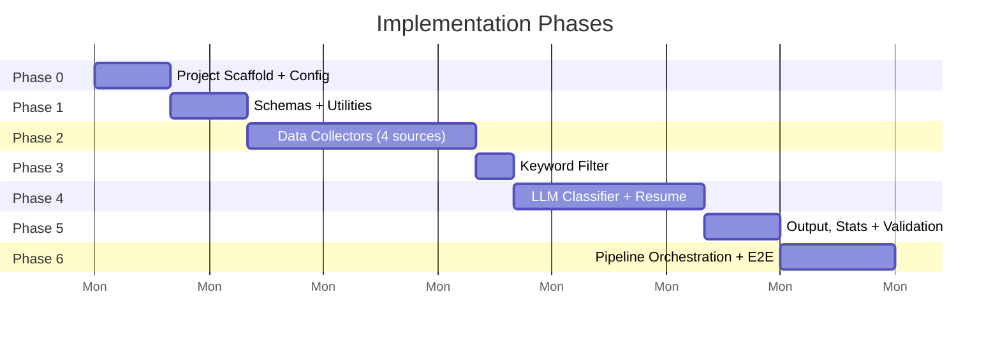
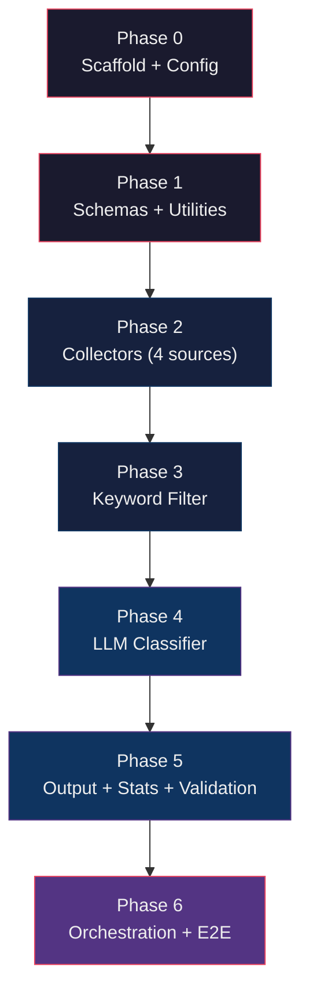

# Implementation Plan — AI-Powered Discovery Engine
## Phase-Wise Build Guide

> This plan breaks the architecture into **6 sequential phases**, each producing
> a testable, standalone milestone. Every phase ends with a concrete checkpoint
> that proves the phase works before moving on.
>
> **Estimated total build time: 2–3 focused days.**

---

## Phase Map



---

## Phase 0 — Project Scaffold & Configuration
**Goal:** Runnable project skeleton with all directories, config files, and
secrets wired up. No business logic yet.

### Tasks

#### 0.1 Create directory tree
Create every directory and `__init__.py` file from [architecture.md §2](file:///c:/Users/Prince%20Gupta/.antigravity-ide/GooglePhotos_Discovery_Model/architecture.md#L48):

```
GooglePhotos_Discovery_Model/
├── config/
│   ├── settings.yaml
│   └── prompts/
│       └── classification.txt
├── src/
│   ├── __init__.py
│   ├── main.py
│   ├── collectors/  (__init__.py, base.py, play_store.py, reddit.py, app_store.py, forum.py)
│   ├── filter/      (__init__.py, keyword_filter.py)
│   ├── classifier/  (__init__.py, groq_client.py, tagger.py, schema.py)
│   ├── output/      (__init__.py, csv_writer.py, stats.py)
│   ├── validation/  (__init__.py, sampler.py)
│   └── utils/       (__init__.py, logger.py, io.py)
├── data/
│   ├── raw/
│   └── filtered/
├── .env.example
├── .gitignore
├── requirements.txt
└── README.md
```

#### 0.2 Write `requirements.txt`
```
pydantic>=2.0
python-dotenv>=1.0
pyyaml>=6.0
requests>=2.31
google-play-scraper>=1.2
groq>=0.5
```

#### 0.3 Write `config/settings.yaml`
Copy the full YAML block from [architecture.md §6](file:///c:/Users/Prince%20Gupta/.antigravity-ide/GooglePhotos_Discovery_Model/architecture.md#L591) verbatim —
collection targets, filter keywords, classifier config (model, temperature,
delay, prompt path), and validation settings.

#### 0.4 Write `config/prompts/classification.txt`
Copy the exact system prompt from PRD §4 — the one starting with
*"Analyze this Google Photos user review or post…"*. Include the
`{review_text}` placeholder.

#### 0.5 Write `.env.example` and `.gitignore`
```bash
# .env.example
GROQ_API_KEY=your_groq_api_key
```
`.gitignore` must include: `.env`, `data/raw/`, `data/filtered/`,
`data/tagged_dataset.csv`, `data/error_log.json`, `__pycache__/`, `*.pyc`.

#### 0.6 Install dependencies
```bash
pip install -r requirements.txt
```

### ✅ Phase 0 Checkpoint
- `python -c "import pydantic, groq; print('OK')"` succeeds.
- `config/settings.yaml` loads without parse errors:
  `python -c "import yaml; yaml.safe_load(open('config/settings.yaml'))"`
- `.env` file exists with real credentials (Groq API key).

---

## Phase 1 — Schemas & Utilities
**Goal:** All shared data types and helper functions are defined and tested
in isolation, before any pipeline stage is built.

### Tasks

#### 1.1 `src/classifier/schema.py` — Pydantic Models

Define both models exactly as specified in [architecture.md §3.1 and §3.3](file:///c:/Users/Prince%20Gupta/.antigravity-ide/GooglePhotos_Discovery_Model/architecture.md#L117):

```python
from pydantic import BaseModel
from typing import Optional, List, Literal

class RawItem(BaseModel):
    source: Literal["play_store", "reddit", "app_store", "forum"]
    text: str
    date: Optional[str] = None
    rating: Optional[float] = None
    url: Optional[str] = None

class TaggedItem(BaseModel):
    source: Literal["play_store", "reddit", "app_store", "forum"]
    date: Optional[str] = None
    rating: Optional[float] = None
    url: Optional[str] = None
    is_relevant: Literal["yes", "no"]
    content_type: Literal["photo", "screenshot", "document", "video", "not_mentioned"]
    retrieval_scenario: str
    what_they_remembered: str
    what_they_forgot: str
    search_attempt: str
    outcome: Literal["found", "gave_up", "found_via_workaround", "not_mentioned"]
    failure_point: List[Literal[
        "expression", "system_understanding",
        "evaluation", "refinement", "unknown_unclear"
    ]]
    workaround_used: str
    evidence_quote: str
```

#### 1.2 `src/utils/io.py` — Read/Write Helpers

```python
def load_json(path: str) -> list | dict: ...
def save_json(data, path: str) -> None: ...
def load_config(path: str = "config/settings.yaml") -> dict: ...
def load_prompt(path: str) -> str: ...
```

- `save_json`: Create parent directories if missing. Use `ensure_ascii=False`
  for proper Unicode.
- `load_config`: Loads YAML, loads `.env` via `python-dotenv`.

#### 1.3 `src/utils/logger.py` — Structured Logging

Simple `logging` module wrapper. Each log line should include:
`[STAGE] [SOURCE] message`. Example:
```
[COLLECT] [play_store] Scraped 450 items
[FILTER]  [play_store] 450 in → 412 passed, 38 dropped
[CLASSIFY] Processing item 127/1102...
```

### ✅ Phase 1 Checkpoint
- Create a test script that instantiates a `RawItem` and a `TaggedItem`
  with sample data — both must validate without errors.
- `TaggedItem` with an invalid `outcome` value (e.g. `"maybe"`) must raise
  `ValidationError`.
- `save_json` → `load_json` round-trip produces identical data.
- `load_config()` returns the full settings dict with all expected keys.

---

## Phase 2 — Data Collectors (Stage 1)
**Goal:** All four collectors work independently and write `data/raw/<source>_raw.json`.
Build them one at a time in dependency order.

### Tasks

#### 2.1 `src/collectors/base.py` — Abstract Base Class

```python
class BaseCollector(ABC):
    @abstractmethod
    def collect(self, target_volume: int) -> List[RawItem]: ...

    def save(self, items: List[RawItem], path: str) -> None:
        save_json([item.model_dump() for item in items], path)
```

#### 2.2 `src/collectors/play_store.py` — Play Store Collector

**Library:** `google-play-scraper`

```python
from google_play_scraper import Sort, reviews

class PlayStoreCollector(BaseCollector):
    def collect(self, target_volume: int) -> List[RawItem]:
        # 1. Fetch reviews with Sort.MOST_RELEVANT, then Sort.NEWEST
        # 2. Map each to RawItem(source="play_store", text=..., date=..., rating=..., url=None)
        # 3. Deduplicate by review text hash
        # 4. Return up to target_volume items
```

**Key implementation details:**
- `reviews()` returns results in batches (use `continuation_token` for pagination).
- Pull across all star ratings (1–5), don't filter by rating.
- Package ID: `com.google.android.apps.photos` (from config).
- Date format: convert to `YYYY-MM-DD` string.

**Test independently:**
```bash
python -c "from src.collectors.play_store import PlayStoreCollector; c = PlayStoreCollector(); print(len(c.collect(20)))"
```

#### 2.3 `src/collectors/reddit.py` — Reddit Collector (Browser Stub)

```python
class RedditCollector(BaseCollector):
    """
    Browser-automation stub for Reddit (r/googlephotos + cross-Reddit search).

    Reddit's official API now requires prior approval under their
    Responsible Builder Policy, so we use browser-based collection
    (same pattern as forum.py).

    Target pages:
        https://www.reddit.com/r/googlephotos/
        https://www.reddit.com/search/?q="google+photos+search"
        https://www.reddit.com/search/?q="google+photos+find"
        https://www.reddit.com/search/?q="google+photos+can't+find"
        https://www.reddit.com/search/?q="google+photos+missing"

    Elements to extract per thread:
        - Post title + body text
        - Top-level comments (first 5–10)
        - Post date
        - Thread URL (permalink)

    Actual scraping delegated to Antigravity browser agent at runtime.
    """
    def collect(self, target_volume: int) -> List[RawItem]:
        logger.info(f"Reddit collector is a browser stub. Target: {target_volume}")
        # At runtime, AGY fills data/raw/reddit_raw.json directly.
        # Check if the file exists; if so, load and return.
        reddit_path = "data/raw/reddit_raw.json"
        if os.path.exists(reddit_path):
            return [RawItem(**item) for item in load_json(reddit_path)]
        return []
```

**Key implementation details:**
- Collect **both** post body text and top-level comments as separate items.
- Search queries from config: `"google photos search"`, `"google photos find"`,
  `"google photos can't find"`, `"google photos missing"`.
- Date format: `YYYY-MM-DD`.
- URL: full permalink to the thread.
- Actual browser automation is delegated to AGY at runtime (same as `forum.py`).

**Test independently:**
```bash
python -c "from src.collectors.reddit import RedditCollector; c = RedditCollector(); print(len(c.collect(20)))"
```

#### 2.4 `src/collectors/app_store.py` — App Store Collector (RSS + Fallback)

**Primary method:** Apple Customer Reviews RSS feed (see [architecture.md §4.1a](file:///c:/Users/Prince%20Gupta/.antigravity-ide/GooglePhotos_Discovery_Model/architecture.md#L263)).

```python
class AppStoreCollector(BaseCollector):
    RSS_URL = (
        "https://itunes.apple.com/{country}/rss/customerreviews"
        "/id={app_id}/sortby=mostrecent/json"
    )
    COUNTRIES = ["us", "gb", "in", "au", "ca"]  # From config

    def collect(self, target_volume: int) -> List[RawItem]:
        items = self._fetch_rss(target_volume)
        if len(items) < target_volume:
            logger.warning(f"RSS returned {len(items)}/{target_volume}. Falling back to browser.")
            items += self._browser_fallback(target_volume - len(items))
        return items[:target_volume]

    def _fetch_rss(self, limit: int) -> List[RawItem]:
        # 1. For each country in COUNTRIES:
        #    - GET the RSS URL with app_id from config
        #    - Parse JSON response → extract feed.entry[]
        #    - Map each entry to RawItem:
        #        text = entry["content"]["label"]
        #        rating = int(entry["im:rating"]["label"])
        #        date = entry["updated"]["label"][:10]  # "YYYY-MM-DD"
        #        url = entry["link"]["attributes"]["href"]  (if available)
        # 2. Deduplicate across countries by author+content hash
        # 3. Return collected items
        ...

    def _browser_fallback(self, remaining: int) -> List[RawItem]:
        # Stub: docstring describes what pages/elements to scrape.
        # Actual execution delegated to Antigravity browser agent.
        logger.info(f"Browser fallback requested for {remaining} items.")
        return []  # Filled at runtime by AGY
```

**Test independently:**
```bash
python -c "from src.collectors.app_store import AppStoreCollector; c = AppStoreCollector(); items = c.collect(10); print(len(items), items[0].text[:80] if items else 'empty')"
```

#### 2.5 `src/collectors/forum.py` — Forum Collector (Browser Stub)

```python
class ForumCollector(BaseCollector):
    """
    Browser-automation stub for Google Photos Community forum.

    Target pages:
        https://support.google.com/photos/community
        Navigate threads about search, finding, retrieving photos.

    Elements to extract per thread:
        - Original post body text
        - Top replies (first 3–5)
        - Post date
        - Thread URL

    Actual scraping delegated to Antigravity browser agent at runtime.
    """
    def collect(self, target_volume: int) -> List[RawItem]:
        logger.info(f"Forum collector is a browser stub. Target: {target_volume}")
        # At runtime, AGY fills data/raw/forum_raw.json directly.
        # Check if the file exists; if so, load and return.
        forum_path = "data/raw/forum_raw.json"
        if os.path.exists(forum_path):
            return [RawItem(**item) for item in load_json(forum_path)]
        return []
```

### ✅ Phase 2 Checkpoint
- Run each collector independently and verify output:
  - `data/raw/play_store_raw.json` — 450 items, all valid `RawItem`.
  - `data/raw/reddit_raw.json` — 350 items.
  - `data/raw/app_store_raw.json` — ≥50 items from RSS (browser fallback may add more later).
  - `data/raw/forum_raw.json` — 0 items initially (stub), populated later via AGY.
- Spot-check 5 items per source: `text` is non-empty, `source` is correct,
  `date` format is `YYYY-MM-DD` or null.
- Total raw items across sources: ≥800 (forum will be added later via browser agent).

---

## Phase 3 — Keyword Filter (Stage 2)
**Goal:** Filter removes obviously irrelevant items and logs per-source drop
counts.

### Tasks

#### 3.1 `src/filter/keyword_filter.py`

Implement exactly as in [architecture.md §4.2](file:///c:/Users/Prince%20Gupta/.antigravity-ide/GooglePhotos_Discovery_Model/architecture.md#L319):

```python
EXCLUSION_KEYWORDS = [
    "storage full", "subscription price", "crashes", "won't open",
    "ads", "backup failed", "account locked", "payment issue"
]

def should_exclude(text: str) -> bool:
    text_lower = text.lower()
    return any(kw in text_lower for kw in EXCLUSION_KEYWORDS)

def filter_items(items: List[RawItem]) -> tuple[List[RawItem], dict]:
    """
    Returns:
        - filtered_items: items that passed the filter
        - stats: dict of { source: { input, dropped, passed } }
    """
    passed = []
    stats = {}
    for item in items:
        src = item.source
        if src not in stats:
            stats[src] = {"input": 0, "dropped": 0, "passed": 0}
        stats[src]["input"] += 1
        if should_exclude(item.text):
            stats[src]["dropped"] += 1
        else:
            stats[src]["passed"] += 1
            passed.append(item)
    return passed, stats
```

#### 3.2 Integration with raw data

- Load all `data/raw/*_raw.json` files.
- Merge into one list.
- Run through `filter_items()`.
- Save output to `data/filtered/filtered_items.json`.
- Log filter stats to console.

### ✅ Phase 3 Checkpoint
- `data/filtered/filtered_items.json` exists and contains fewer items than
  the sum of raw files.
- Filter stats are logged per source (example):
  ```
  [FILTER] play_store: 450 in → 412 passed, 38 dropped
  [FILTER] reddit:     350 in → 328 passed, 22 dropped
  ```
- Manually check 3 dropped items — they should contain an exclusion keyword.
- Manually check 3 passed items — they should NOT contain an exclusion keyword.

---

## Phase 4 — LLM Classifier (Stage 3)
**Goal:** Each filtered item is classified by Groq's LLM into the TaggedItem
schema. This is the most complex and critical phase.

### Tasks

#### 4.1 `src/classifier/groq_client.py` — API Wrapper

```python
from groq import Groq
import time, json

class GroqClassificationError(Exception): pass

class GroqClient:
    def __init__(self, api_key: str, model: str):
        self.client = Groq(api_key=api_key)
        self.model = model

    def classify(self, system_prompt: str, user_text: str,
                 max_retries: int = 3, delay: float = 2.0) -> dict:
        for attempt in range(max_retries):
            try:
                response = self.client.chat.completions.create(
                    model=self.model,
                    messages=[
                        {"role": "system", "content": system_prompt},
                        {"role": "user", "content": user_text}
                    ],
                    response_format={"type": "json_object"},
                    temperature=0.0
                )
                result = json.loads(response.choices[0].message.content)
                time.sleep(delay)
                return result
            except Exception as e:
                if "429" in str(e):  # Rate limit
                    wait = (attempt + 1) * 5  # Exponential backoff
                    logger.warning(f"Rate limited. Waiting {wait}s...")
                    time.sleep(wait)
                else:
                    if attempt == max_retries - 1:
                        raise GroqClassificationError(str(e))
                    time.sleep(delay)
```

**Key implementation details:**
- Model ID comes from config — **never hardcoded**.
- `response_format={"type": "json_object"}` enforces valid JSON output.
- `temperature=0.0` for deterministic classification.
- Delay of 2 seconds between calls (configurable via `settings.yaml`).
- Retry logic: 3 attempts with exponential backoff on 429s.

#### 4.2 `src/classifier/tagger.py` — Prompt Builder & Classifier

```python
class Tagger:
    def __init__(self, client: GroqClient, prompt_template: str):
        self.client = client
        self.prompt_template = prompt_template

    def tag(self, item: RawItem) -> Optional[TaggedItem]:
        # 1. Build user message: inject item.text into prompt template
        user_msg = self.prompt_template.replace("{review_text}", item.text)

        # 2. Call Groq API
        try:
            raw_result = self.client.classify(
                system_prompt=self.prompt_template,
                user_text=item.text
            )
        except GroqClassificationError as e:
            log_error("classify", item, "api_error", str(e))
            return None

        # 3. Check is_relevant
        if raw_result.get("is_relevant") == "no":
            return None

        # 4. Validate through Pydantic
        try:
            tagged = TaggedItem(
                source=item.source,
                date=item.date,
                rating=item.rating,
                url=item.url,
                **raw_result
            )
            return tagged
        except ValidationError as e:
            log_error("classify", item, "validation_error", str(e), raw_result)
            return None
```

#### 4.3 Resume Logic (Hash-Based Dedup)

Add to `tagger.py` or a helper:

```python
import hashlib

def item_hash(item: RawItem) -> str:
    return hashlib.sha256(f"{item.source}:{item.text}".encode()).hexdigest()[:16]

def load_already_processed(csv_path: str) -> set:
    """Load hashes of items already in tagged_dataset.csv to skip on re-run."""
    if not os.path.exists(csv_path):
        return set()
    # Read CSV, reconstruct hash from source + original text columns
    ...
```

When classifying, skip any item whose hash is already in the processed set.

#### 4.4 Error Logging

```python
def log_error(stage, item, error_type, message, raw_response=None):
    """Append error entry to data/error_log.json"""
    entry = {
        "timestamp": datetime.utcnow().isoformat() + "Z",
        "stage": stage,
        "source": item.source,
        "item_text_preview": item.text[:100],
        "error_type": error_type,
        "raw_response": str(raw_response) if raw_response else None,
        "error_message": message
    }
    # Append to error_log.json (load existing, append, save)
```

### ✅ Phase 4 Checkpoint

**4.A — Smoke test (5 items):**
- Take 5 items from `filtered_items.json`.
- Run tagger on them manually.
- Verify each returns a valid `TaggedItem` or `None` (if irrelevant).
- Check that `evidence_quote` is actually present in the original `text`.
- Check that `failure_point` is a list (not a string).

**4.B — Volume test (~50 items):**
- Run tagger on 50 items.
- Verify rate limiting works (no 429 errors, ~2 sec/call).
- Check `data/error_log.json` — should be empty or have very few entries.

**4.C — Resume test:**
- Run tagger on 20 items → produces partial `tagged_dataset.csv`.
- Re-run tagger on the same 20 items → should skip all 20 (already processed).
- Log should show `Skipping 20 already-processed items`.

---

## Phase 5 — Output, Stats & Validation (Stage 4)
**Goal:** Tagged items are written to CSV, aggregate stats are computed,
and a validation sample is extracted.

### Tasks

#### 5.1 `src/output/csv_writer.py`

```python
import csv

def write_tagged_csv(items: List[TaggedItem], path: str) -> None:
    """
    Write TaggedItem list to CSV.
    - failure_point list → pipe-delimited string ("expression|refinement")
    - UTF-8 with BOM for Excel compatibility
    - CSV column order matches PRD §4 exactly
    """
    columns = [
        "source", "date", "rating", "url", "is_relevant",
        "content_type", "retrieval_scenario", "what_they_remembered",
        "what_they_forgot", "search_attempt", "outcome",
        "failure_point", "workaround_used", "evidence_quote"
    ]
    with open(path, "w", newline="", encoding="utf-8-sig") as f:
        writer = csv.DictWriter(f, fieldnames=columns)
        writer.writeheader()
        for item in items:
            row = item.model_dump()
            row["failure_point"] = "|".join(row["failure_point"])
            writer.writerow(row)
```

#### 5.2 `src/output/stats.py`

```python
def compute_stats(items: List[TaggedItem], pipeline_counts: dict) -> dict:
    """
    Generate summary_stats.json with:
    - by_failure_point (note: multi-label, sums > total)
    - by_content_type
    - by_source
    - total_tagged, total_raw_collected, total_dropped_keyword_filter,
      total_dropped_llm_irrelevant
    """
    stats = {
        "by_failure_point": {},
        "by_content_type": {},
        "by_source": {},
        "total_tagged": len(items),
        **pipeline_counts  # total_raw, dropped counts
    }
    for item in items:
        # Count failure_points (multi-label)
        for fp in item.failure_point:
            stats["by_failure_point"][fp] = stats["by_failure_point"].get(fp, 0) + 1
        # Count content_type
        ct = item.content_type
        stats["by_content_type"][ct] = stats["by_content_type"].get(ct, 0) + 1
        # Count source
        src = item.source
        stats["by_source"][src] = stats["by_source"].get(src, 0) + 1
    return stats
```

#### 5.3 `src/validation/sampler.py`

```python
import random

def extract_validation_sample(
    dataset_path: str,
    sample_size: int = 75,
    seed: int = 42,
    output_path: str = "data/validation_sample.csv"
) -> None:
    """
    1. Load tagged_dataset.csv
    2. Filter to rows only (all are is_relevant=yes)
    3. Random sample of sample_size rows (seeded)
    4. Write with same columns + blank "manual_failure_point" column
    """
    random.seed(seed)
    # Load CSV rows, sample, add blank column, write
```

### ✅ Phase 5 Checkpoint
- `data/tagged_dataset.csv` opens in Excel with correct columns, no encoding
  issues, and `failure_point` values are pipe-delimited.
- `data/summary_stats.json` has all three breakdown views. Verify:
  - `by_failure_point` values sum to **more** than `total_tagged` (multi-label).
  - `by_source` values sum to **exactly** `total_tagged`.
- `data/validation_sample.csv` has 75 rows + a blank `manual_failure_point` column.

---

## Phase 6 — Pipeline Orchestration & End-to-End Run
**Goal:** Single CLI entry point that runs all stages in sequence, with
stage-level checkpointing and a `--stage` flag for selective re-runs.

### Tasks

#### 6.1 `src/main.py` — CLI Orchestrator

```python
import argparse

def main():
    parser = argparse.ArgumentParser(description="Discovery Engine Pipeline")
    parser.add_argument("--stage", choices=[
        "collect", "filter", "classify", "output", "validate", "all"
    ], default="all")
    args = parser.parse_args()

    config = load_config()

    if args.stage in ("collect", "all"):
        run_collect(config)

    if args.stage in ("filter", "all"):
        run_filter(config)

    if args.stage in ("classify", "all"):
        run_classify(config)

    if args.stage in ("output", "all"):
        run_output(config)

    if args.stage in ("validate", "all"):
        run_validate(config)

    logger.info("Pipeline complete.")
```

Each `run_*` function:
1. Reads input from the previous stage's file (checkpointing).
2. Executes the stage logic.
3. Writes output to its designated file.
4. Logs summary (items in, items out, time elapsed).

#### 6.2 Stage Checkpointing Logic

Each `run_*` function checks if its **input file** exists before running:
- `run_filter()` → requires `data/raw/*_raw.json` to exist.
- `run_classify()` → requires `data/filtered/filtered_items.json`.
- `run_output()` → requires `data/tagged_dataset.csv` (or in-memory from classify).

If a stage's input is missing, print a clear error:
```
ERROR: data/filtered/filtered_items.json not found. Run --stage filter first.
```

#### 6.3 End-to-End Run

Run the full pipeline:
```bash
python -m src.main
```

Run individual stages (for debugging or re-running after failures):
```bash
python -m src.main --stage collect
python -m src.main --stage filter
python -m src.main --stage classify   # Supports resume
python -m src.main --stage output
python -m src.main --stage validate
```

#### 6.4 Write `README.md`

Quick-start guide covering:
1. Clone + install dependencies.
2. Copy `.env.example` → `.env`, fill in credentials.
3. Run `python -m src.main` for full pipeline.
4. Output files and what each one contains.
5. How to re-run individual stages.
6. How to change the Groq model (edit `settings.yaml`).

### ✅ Phase 6 Checkpoint — Full E2E Validation

Run the complete pipeline end-to-end and verify all success criteria from
[ProblemStatement.md](file:///c:/Users/Prince%20Gupta/.antigravity-ide/GooglePhotos_Discovery_Model/ProblemStatement.md#L43):

| Criterion | How to Verify |
|-----------|--------------|
| **≥1000 usable, relevant, tagged items** | `wc -l data/tagged_dataset.csv` ≥ 1001 (header + data rows). Check `summary_stats.json → total_tagged`. |
| **Items span 4 sources** | `summary_stats.json → by_source` has all 4 keys with non-zero counts. |
| **Tagging accuracy validated** | `data/validation_sample.csv` exists with 75 rows. Human reviews it and reports agreement %. |
| **Exportable dataset** | Open `tagged_dataset.csv` in Excel/Sheets — columns render correctly, no encoding artifacts. |
| **Reproducible pipeline** | Re-run `python -m src.main --stage classify` — should skip all items (resume). Re-run full pipeline with same `.env` — should produce near-identical output. |
| **Explainable in one slide** | Pipeline has 4 stages, each describable in one sentence. Summary stats are one JSON file. |

---

## Phase Dependency Diagram



---

## Risk Mitigation

| Risk | Likelihood | Mitigation |
|------|-----------|------------|
| **Groq rate limit blocks classification mid-run** | Medium | Resume logic (Phase 4.3) skips already-processed items. Can also switch to higher-quota model (edit `settings.yaml`). |
| **Apple RSS feed returns <50 reviews** | Medium | Browser fallback is coded in (Phase 2.4). Can also add more country codes to config. |
| **Reddit browser agent produces fewer items than target** | Medium | Browser stub allows manual supplementation. Increase search queries in config or run AGY agent again with different query terms. Pipeline still meets 1000+ target from other 3 sources if Reddit is delayed. |
| **LLM misclassifies `failure_point` systematically** | Medium | Validation sample (Phase 5.3) catches this. Document patterns as findings, not just error rate. If severe, iterate on the prompt in `classification.txt`. |
| **Forum browser stub produces 0 items** | High (initially) | Stub is intentional. Forum data is collected via AGY browser agent at runtime. Pipeline still meets 1000+ target from other 3 sources if forum is delayed. |
| **Total usable items <1000 after filtering** | Low | PRD mandates scraping more raw items rather than relaxing relevance. Increase `target_volume` in config for underperforming sources. |

---

## Post-Build Checklist

After all 6 phases are complete, verify these deliverables exist:

- [ ] `data/tagged_dataset.csv` — ~1000+ rows, all `is_relevant=yes`
- [ ] `data/summary_stats.json` — counts by `failure_point`, `content_type`, `source`
- [ ] `data/validation_sample.csv` — 75-row sample with blank `manual_failure_point`
- [ ] `data/error_log.json` — classification errors (should be near-empty)
- [ ] `README.md` — quick-start guide
- [ ] Pipeline is re-runnable: `python -m src.main` completes without errors
- [ ] Human validation complete: agreement % reportable in one line
